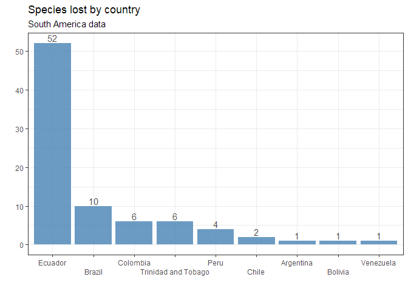

-   [Extint plants](#extint-plants)
-   [Datos de Sudamerica](#datos-de-sudamerica)

Extint plants
-------------

[TidyTuesday
data](https://github.com/rfordatascience/tidytuesday/blob/master/data/2020/2020-08-18/readme.md)
from the **IUCN** [Red List of Trheatened
Species](https://www.iucnredlist.org/)

    plants <- readr::read_csv("https://raw.githubusercontent.com/rfordatascience/tidytuesday/master/data/2020/2020-08-18/plants.csv")

    actions <- readr::read_csv("https://raw.githubusercontent.com/rfordatascience/tidytuesday/master/data/2020/2020-08-18/actions.csv")

    threats <- readr::read_csv("https://raw.githubusercontent.com/rfordatascience/tidytuesday/master/data/2020/2020-08-18/threats.csv")

Datos de Sudamerica
-------------------

    SouthAmP<-plants %>% 
      filter(continent=="South America") %>% 
      group_by(country) %>%
      summarise(Species_Lost=n()) %>% 
      arrange(desc(Species_Lost))

    SouthAmP %>% 
      kable()

<table>
<thead>
<tr>
<th style="text-align:left;">
country
</th>
<th style="text-align:right;">
Species\_Lost
</th>
</tr>
</thead>
<tbody>
<tr>
<td style="text-align:left;">
Ecuador
</td>
<td style="text-align:right;">
52
</td>
</tr>
<tr>
<td style="text-align:left;">
Brazil
</td>
<td style="text-align:right;">
10
</td>
</tr>
<tr>
<td style="text-align:left;">
Colombia
</td>
<td style="text-align:right;">
6
</td>
</tr>
<tr>
<td style="text-align:left;">
Trinidad and Tobago
</td>
<td style="text-align:right;">
6
</td>
</tr>
<tr>
<td style="text-align:left;">
Peru
</td>
<td style="text-align:right;">
4
</td>
</tr>
<tr>
<td style="text-align:left;">
Chile
</td>
<td style="text-align:right;">
2
</td>
</tr>
<tr>
<td style="text-align:left;">
Argentina
</td>
<td style="text-align:right;">
1
</td>
</tr>
<tr>
<td style="text-align:left;">
Bolivia
</td>
<td style="text-align:right;">
1
</td>
</tr>
<tr>
<td style="text-align:left;">
Venezuela
</td>
<td style="text-align:right;">
1
</td>
</tr>
</tbody>
</table>

    ggplot(SouthAmP, aes(forcats::fct_reorder(country,Species_Lost,.desc = TRUE),
                        Species_Lost),
           )+
      geom_col(fill="steelblue", alpha=0.8)+
      geom_text(aes(label=Species_Lost,vjust=-0.25), color="grey30")+
      scale_x_discrete(guide = guide_axis(n.dodge=2))+
      theme(panel.grid.minor = element_blank(),
            panel.grid.major = element_blank(),
            text = element_text(size = 14),
            plot.title = element_text(hjust = 0.5, size = 20)) +
      labs(title = "Species lost by country",
           subtitle = "South America data",
           x="",y="")+
    theme_bw()

