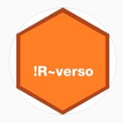

Aqui voy a poner los scripts de las clases del curso introductorio de analisis y manipulacion de datos en R de [!R~verso](https://www.youtube.com/channel/UCOb-12wuWVtrWfqI3p8HL4w) Dictado por [Dereck Corcoran](https://derek-corcoran-barrios.github.io/)

 

